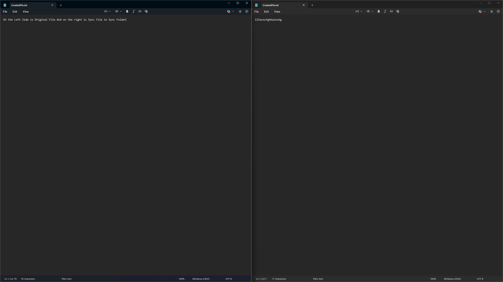
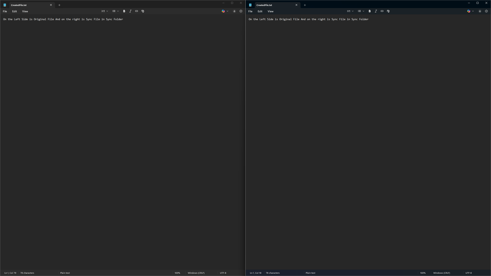
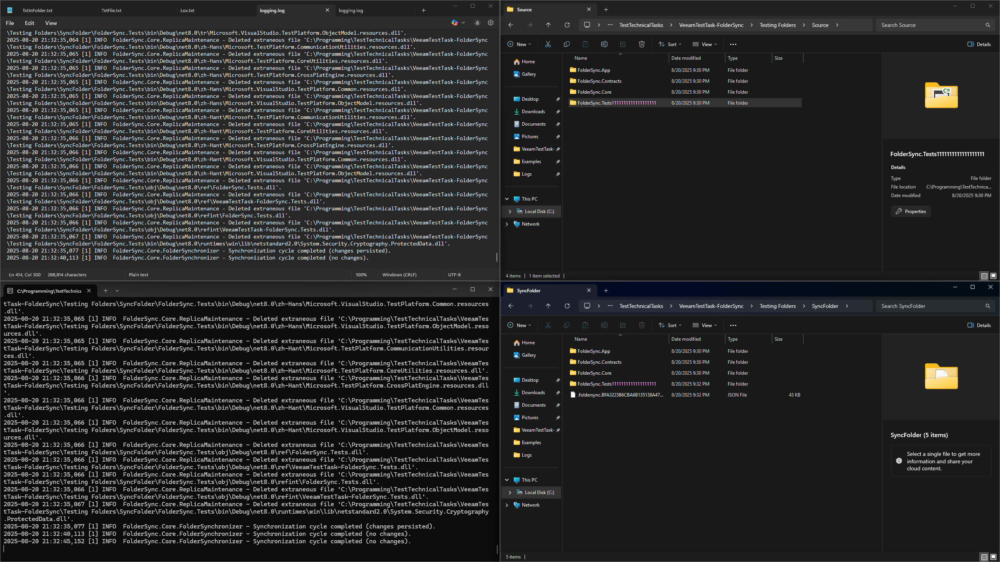
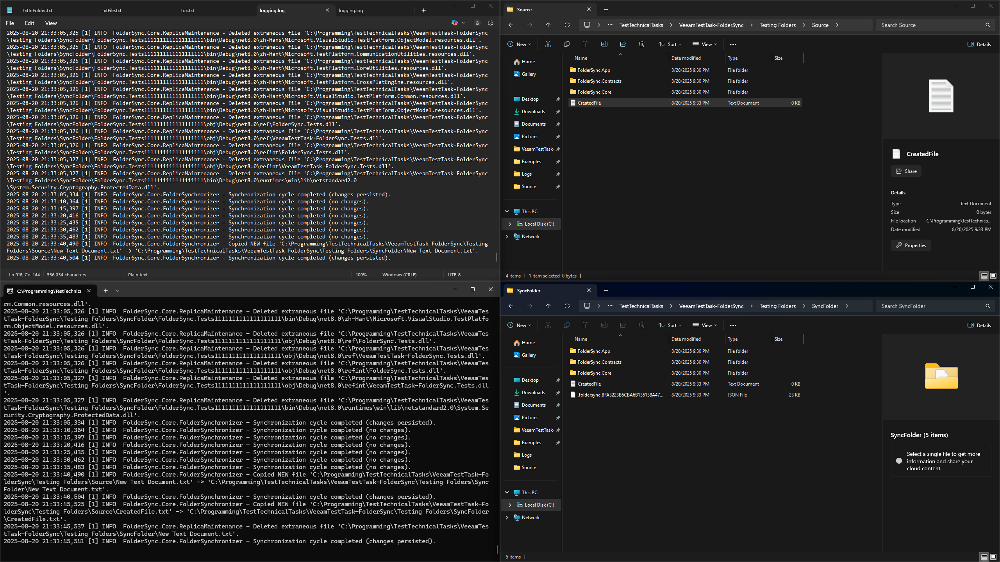
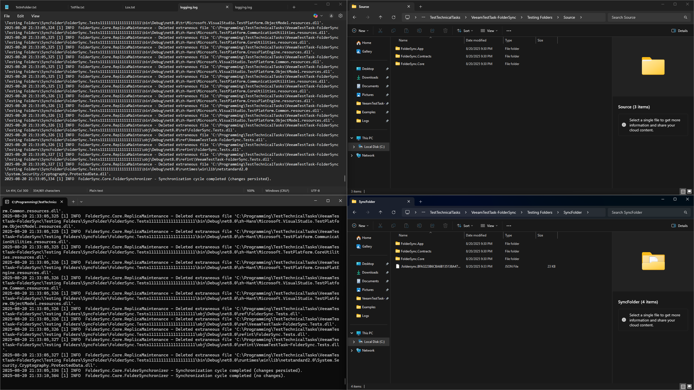

# VeeamTestTask-FolderSync


## Overview
This is a simple folder synchronization console app.
It keeps a replica folder in sync with a source folder at a specified interval, logging all operations.

## Features
- **Efficient Caching of File Updates:**
	- Only changed or new files are copied, using a snapshot of file states to avoid unnecessary operations.
- **Replica Integrity Checking:**
	- The replica folder is continuously checked. If any file or folder disappears from the replica but still exists in the source, it will be automatically restored (copied again) from the source.
- **State Persistence in JSON:**
	- The app stores a snapshot of the last sync state in a JSON file inside the replica folder. This allows the app to resume from where it left off after a restart, ensuring no redundant copying or data loss.
- **Safe Restart:**
	- You can stop and restart the app at any time. It will pick up changes since the last run using the persisted snapshot.
- **Optimized Synchronization:**
	- Uses in-memory and on-disk snapshots to minimize disk I/O and speed up sync cycles.
- **Robust File Update Logic:**
	- Detects new, changed, and deleted files and folders, ensuring the replica is always an accurate mirror of the source.
- **Logging:**
	- All operations and errors are logged to a file for easy troubleshooting and auditing.
- **Error Handling and Retries:**
	- File copy operations are retried on failure to handle transient errors.


## How to Run
1. Build the solution using Visual Studio or `dotnet build`.
2. Run the application from the command line:

```
dotnet run --project FolderSync.App -- -s "<SourceFolder>" -r "<ReplicaFolder>" -i <IntervalMs> -l "<LogFilePath>"
```

Or, if you have a compiled executable (e.g., `FolderSync.exe`):

```
FolderSync.exe -s "C:\Source" -r "C:\Replica" -i 2000 -l "C:\Logs\sync.log"
```

### Arguments
- `-s`, `--source`   : Path to the source folder (required)
- `-r`, `--replica`  : Path to the replica folder (required)
- `-i`, `--interval` : Synchronization interval in milliseconds (required)
- `-l`, `--log`      : Path to the log file (required)

## Where It Can Be Used
- Keeping a backup folder in sync with a main folder (even remote, virtual machine, server)

## Example

```
dotnet run --project FolderSync.App -- -s "C:\Data\Source" -r "C:\Data\Replica" -i 5000 -l "C:\Logs\sync.log"
```


This will synchronize `C:\Data\Source` to `C:\Data\Replica` every 5 seconds, logging to `C:\Logs\sync.log`.

---

## Examples

### Screenshots

**Before Sync:**


**After Sync:**


**Changed Folder Name:**


**Created Some File:**


**Deleted Folder:**


**Screenshot (UI Example):**


### Example Log File

You can find a sample log file in [Examples/logging.log](Examples/logging.log).

